# Splunk_bruteforce_investigation
A bruteforce attack occurs when a hacker tries different combinations of usernames and password to break into a system.
The scenario running through all 7 stages is this: IP 185.220.101.5 brute-forced into bob's account, then moved laterally across the network.

[Download dataset used](./Data/splunkdata.csv)

[View Raw Data](https://raw.githubusercontent.com/yourrepo/data/logs.csv)


The first step is to ingest data into the splunk software.
After data ingestion:

Confirm the data is there by clicking `search and and reporting` then type the command:

```spl
index=main sourcetype=csv
```
``` spl
index=main sourcetype=csv
| fieldsummary
| table field, count
```
Output:
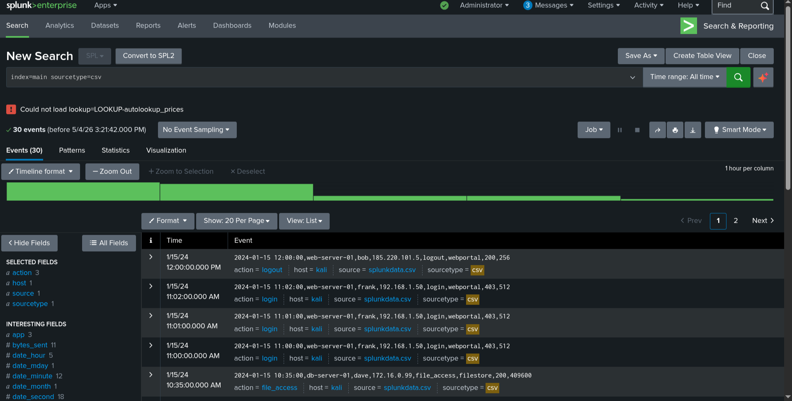

This is where you first see the attack. The basic search `index=main sourcetype=csv` dumps everything — as an analyst you'd run this first to confirm your logs are present and understand what fields are available.

### SPL basics: Filter and search
Find all failed logins:
``` spl 
index=main sourcetype=csv action=login status_code=401
```

#### Output
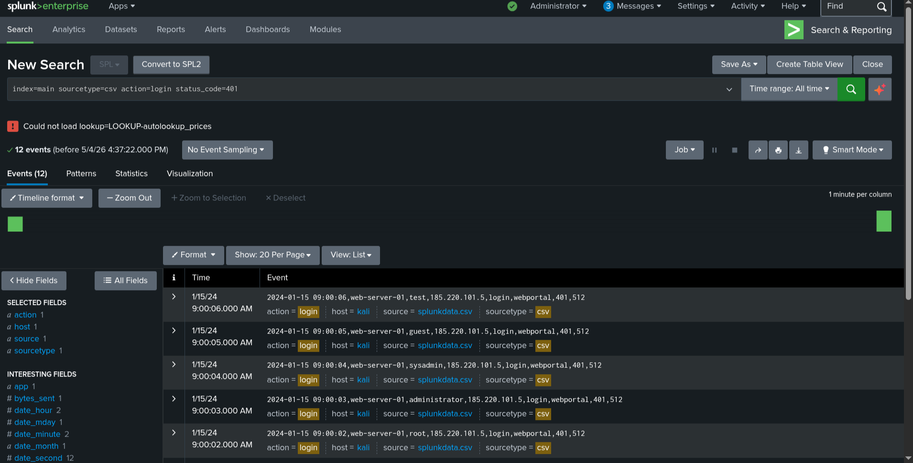

The critical search here is `action=login status_code=401`. In a brute force investigation, the 401 (Unauthorized) events are the attack itself. 
Every failed login is one password or username guess. Running this search shows you the raw evidence — the actual attempted logins. 

Without filtering to 401s you'd be drowning in successful logins, file accesses, and logouts that aren't relevant yet.

### Filter to specific fields only:
``` spl
index=main sourcetype=csv action=login status_code=401
| fields _time, host, user, src_ip
```
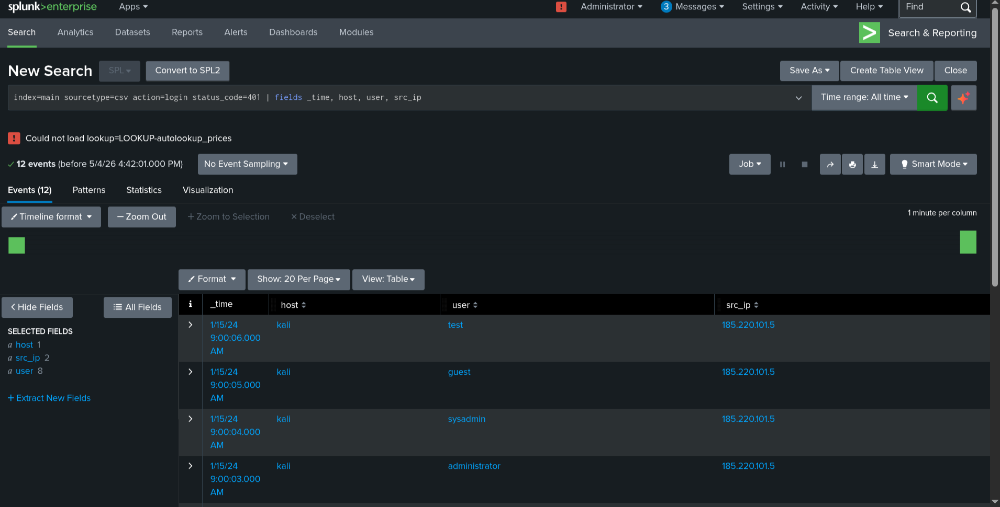


### Find a specific user's activity:

``` spl
index=main sourcetype=csv user=alice
| table _time, host, action, app, bytes_sent
```
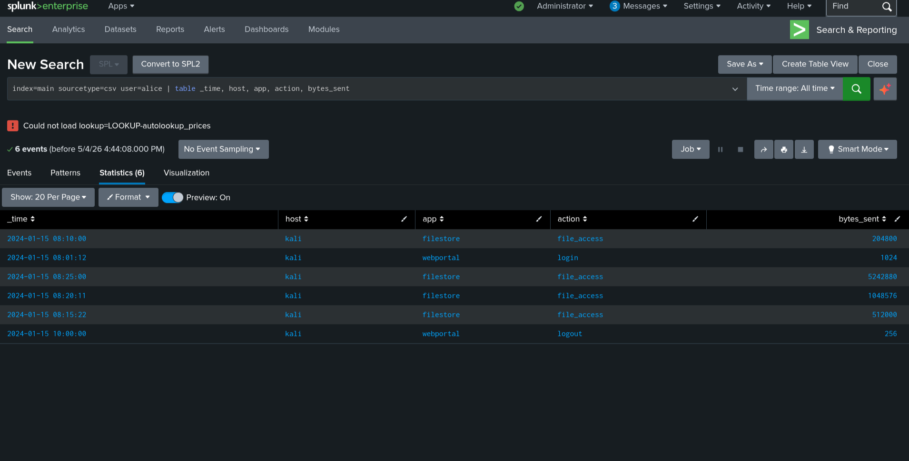

The | fields and | table commands are how you reduce noise. A raw Splunk event has dozens of fields. 
When investigating a brute force you only care about time, who, from where and did it succeed. Table gives you exactly that clean view.

### Count events per user:
``` spl
index=main sourcetype=csv
| stats count by user, action
| sort -count
```
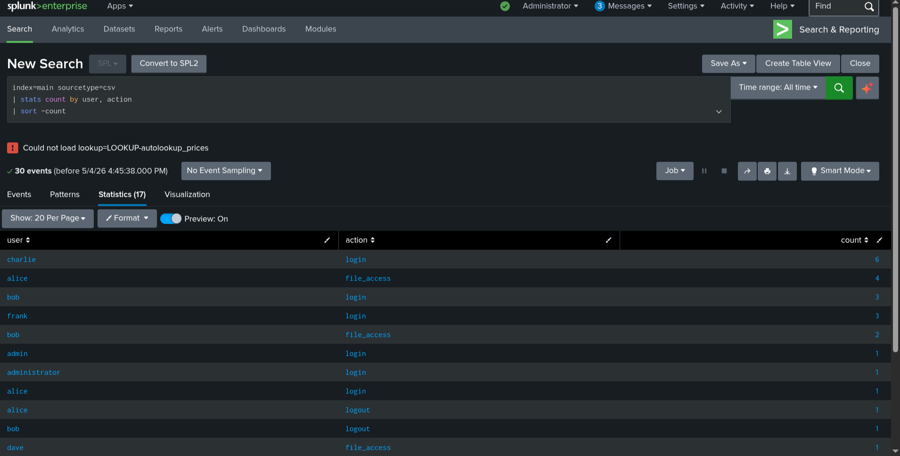

The stats count by user, action search immediately surfaces anomalies. Normal users have a handful of events. 
An attacker making 7 login attempts across different usernames shows up as a spike. sort -count puts the highest activity at the top — your eye goes straight to the problem.

### See failed logins over time:
``` spl 
index=main sourcetype=csv action=login status_code=401
| timechart count by src_ip
```
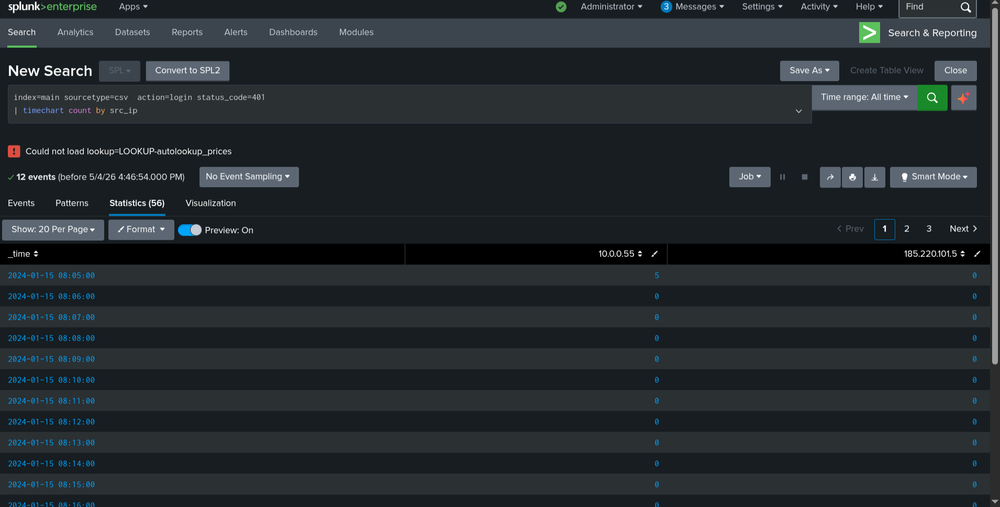

`timechart count by src_ip` is one of the most powerful brute force detection tools in Splunk. It plots failed logins over time, grouped by source IP. 
A brute force attack looks unmistakable on this chart — a flat baseline of normal activity then a sharp vertical spike at 09:00 from 185.220.101.5. 
No legitimate user behaviour produces that spike shape. This is how SOC analysts spot attacks visually without reading individual events.

### Top source IPs:
``` spl
index=main sourcetype=csv
| top limit=10 src_ip
```
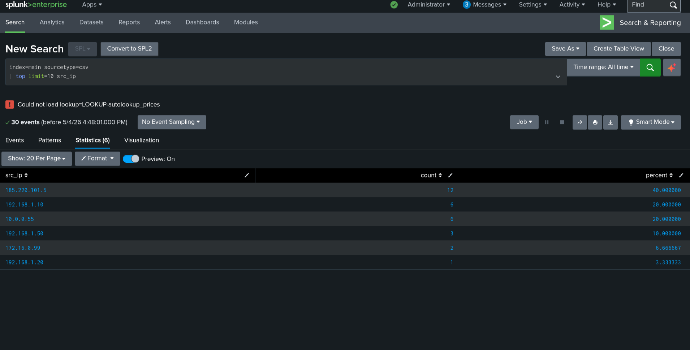

### Total data transferred per user (bytes):
``` spl 
index=main sourcetype=csv action=file_access
| stats sum(bytes_sent) as total_bytes by user
| eval total_MB = round(total_bytes/1048576, 2)
| sort -total_MB
```
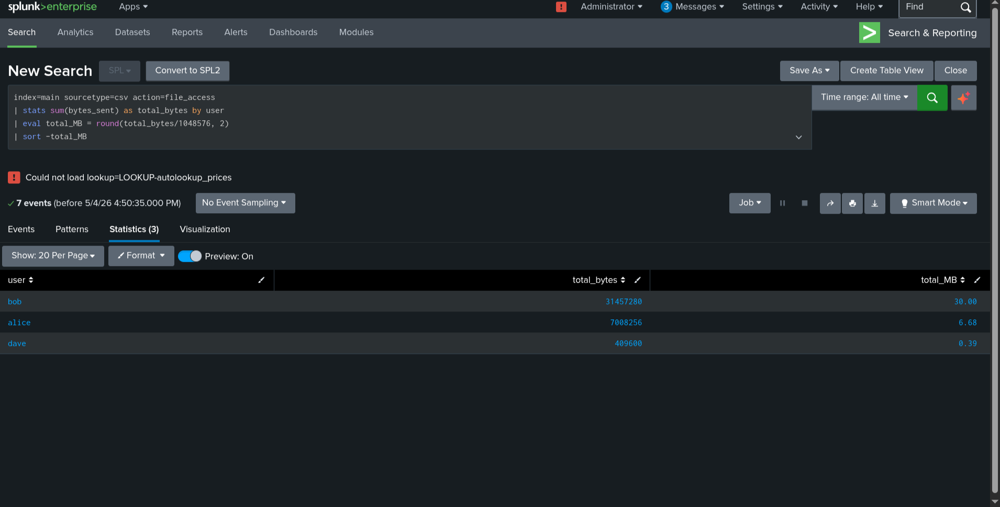

The `sum(bytes_sent)` stats search starts connecting the brute force to its consequences. Once the attacker got in as bob, they started transferring data. 
Measuring total bytes per user shows alice and bob both moved abnormal amounts of data — alice before the attack (insider threat angle) and bob after the attacker got in.

### Create a human-readable status label using eval:
``` spl 
index=main sourcetype=csv
| eval outcome = case(status_code==200, "Success", status_code==401, "Unauthorized", status_code==403, "Forbidden", true(), "Other")
| stats count by user, outcome
```

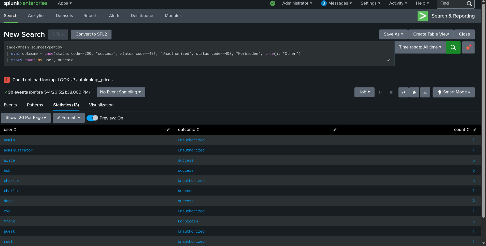

Raw status codes like 401 and 200 mean something to engineers but not necessarily to a manager, a legal team or an incident report. `eval with case()` translates machine language into human language. When you produce an incident report after the brute force investigation, a table showing charlie: 5 Unauthorized, 1 Success is immediately understood by anyone reading it.

More importantly for the investigation, the outcome table reveals the full cast of characters at a glance. You see charlie had 5 unauthorized before succeeding, bob had unauthorized attempts from the external IP, frank had 403 (Forbidden — a different type of access denial, possibly a locked account).

### Extract just the subnet from src_ip using rex:
```spl 
index=main sourcetype=csv
| rex field=src_ip "(?<subnet>\d+\.\d+\.\d+)\.\d+"
| stats count by subnet
```
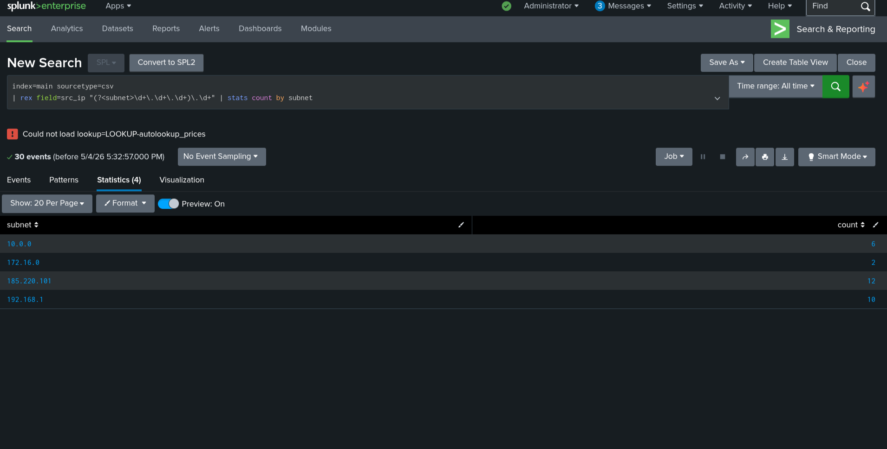

The rex subnet extraction is where brute force investigation gets geographical and network-contextual. By stripping the last octet you group IPs by network:

* 192.168.1.x — internal network, normal users
* 172.16.0.x — internal, different subnet
* 10.0.0.x — internal
* 185.220.101.x — external public internet

This immediately separates internal activity from external attack traffic. In a brute force investigation, seeing that all 401 events cluster under one external subnet is damning evidence. In a real environment, 185.220.101.x is a known Tor exit node range — that additional context (which you'd get from a threat intel lookup) makes the case even stronger.

### Build a dashboard
In Splunk, run this search, then click Save As → Dashboard Panel:
``` spl 
index=main sourcetype=csv action=login
| timechart count by status_code
```

Create a second panel using:
``` spl 
index=main sourcetype=csv
| stats count by user
| sort -count
``` 
Arrange both panels into a dashboard called "Overview". Use the time picker to filter both panels simultaneously.

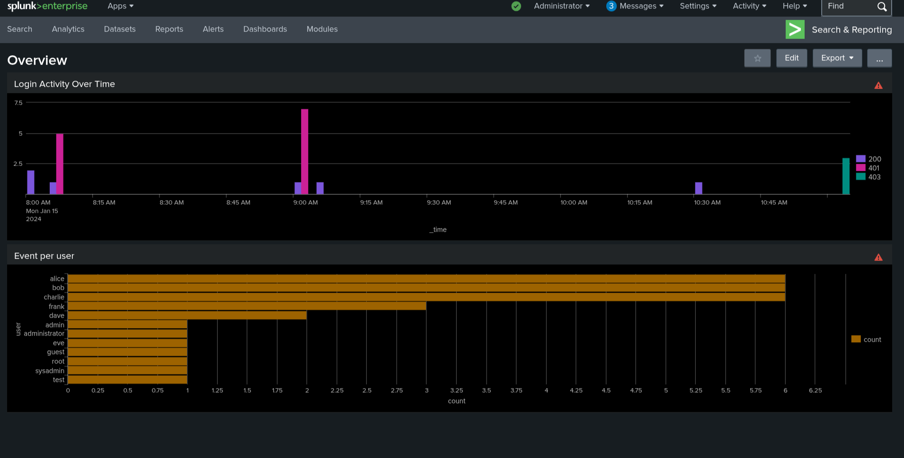

Individual searches answer individual questions. A dashboard puts all your investigative views on one screen simultaneously so you can see relationships between them.

In a brute force investigation, the two-panel dashboard does something powerful. The timechart (Panel 1) shows you the attack timeline — the spike of 401s at 09:00 is visually obvious. 
The user count table (Panel 2) shows you who is most involved. When you look at both panels together you can immediately correlate: the spike happened at 09:00, bob shows high event count, therefore bob's account is at the centre of whatever happened at 09:00.

In a real SOC this dashboard would be on a screen during an active incident. As new events come in (dashboards auto-refresh), the timechart updates in real time showing whether the attack is continuing or has stopped. The user table updates showing new accounts being targeted. 

This is situational awareness — knowing what's happening right now without running manual searches every few minutes.
The time picker affects both panels simultaneously. If one asks "what happened between 9am and 9:30am?" you set the time picker once and both panels instantly scope to that window. You're not re-running two separate searches.

### Create an alert
Run the brute force detection search below, then click Save As → Alert, set it to run every 5 minutes, and trigger when count > 5:
``` spl 
index=main sourcetype=csv action=login status_code=401
| stats count by src_ip
| where count > 5
```

Everything up to this point has been reactive — the attack already happened and you investigated it. Here we makes Splunk proactive. This alert runs automatically every 5 minutes. The moment any IP accumulates more than 5 failed logins in that window, an alert fires.

In the context of your brute force scenario, this alert would have fired at approximately 09:00:05 — after the 6th failed attempt and before the attacker succeeded on attempt 7 at 09:00:07. 
That's a 2-second warning window. In practice, with a real SOC and automated response (like a firewall block triggered by the alert), the attack could be stopped before the successful login ever happens.

The `| where count > 5` threshold is deliberate. Setting it too low (e.g. count > 1) would fire on every user who mistyped their password once — alert fatigue kills a SOC's effectiveness. 
Setting it at 5 means a single mistaken password never triggers it, but a scripted attack trying dozens of usernames absolutely will. This threshold tuning is a real skill in SOC work.
In a production environment, this alert would be connected to:

* Email to the on-call analyst
* PagerDuty/Slack for immediate notification
* SOAR platform to automatically block the IP at the firewall
  
### Security investigation scenarios
#### Scenario A: Brute force detection: IP 185.220.101.5 tried multiple usernames before succeeding. Confirmation:
``` spl index=main sourcetype=csv src_ip=185.220.101.5
| table _time, user, action, status_code, host
| sort _time
```
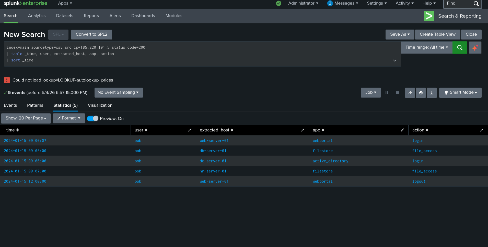

This is your primary evidence of the attack itself. The chronological table shows one IP trying seven different usernames in seven consecutive seconds, all returning 401, until the final attempt returns 200. This single query output is what one would present in an incident report as proof of a brute force attack. It establishes: attacker IP, attack timeframe, accounts targeted and confirmation of successful compromise.

#### Scenario B: Lateral movement: After brute-forcing into bob, the attacker accessed multiple servers. Trace the path:
``` spl
index=main sourcetype=csv src_ip=185.220.101.5 status_code=200
| table _time, user, host, app, action
| sort _time
```
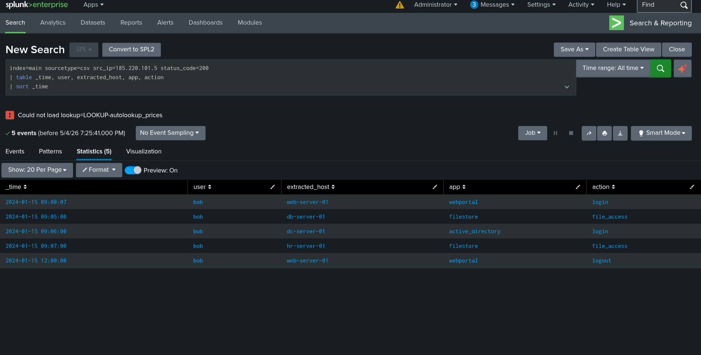

This is your post-compromise evidence. Filtering to `status_code=200` removes all the brute force noise and shows only what the attacker successfully did after getting in. The table reveals the attacker moved from web server to database to domain controller to HR server within 7 minutes. This escalates the severity of the incident significantly — a brute force that stops at the login is a tier 2 incident, but one that reaches the domain controller is a tier 1 critical incident requiring immediate containment.

#### Scenario C: Data exfiltration: alice downloaded an abnormally large amount of data. To find the spike:
``` spl 
index=main sourcetype=csv user=alice action=file_access
| eval MB = round(bytes_sent/1048576, 2)
| table _time, host, MB
| sort _time
```
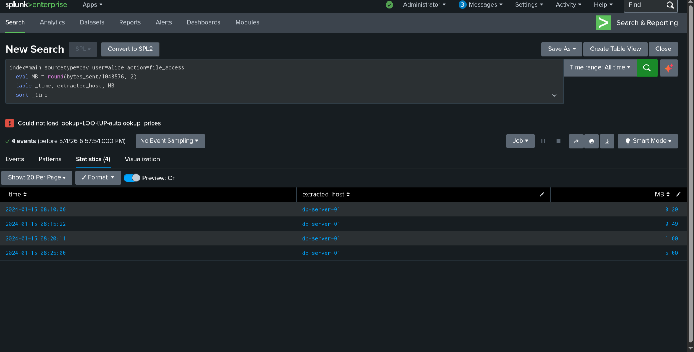

This answers the question every executive asks after a breach: "what data was taken?" The escalating MB values tell you data was actively being exfiltrated. In a real investigation you would now work with the data owner to identify what files live on db-server-01 and what was actually accessed, but Splunk has given you the timeline and the volumes needed to scope the data loss.

#### Scenario D — Full investigation summary: Combine everything into one threat hunting query:
``` spl
index=main sourcetype=csv
| stats count as total_events, sum(bytes_sent) as total_bytes, values(host) as hosts_accessed, values(action) as actions by src_ip, user
| eval risk = case(total_events > 10 AND total_bytes > 5000000, "HIGH", total_events > 5, "MEDIUM", true(), "LOW")
| where risk != "LOW"
| table src_ip, user, risk, total_events, total_bytes, hosts_accessed
| sort -total_bytes
```
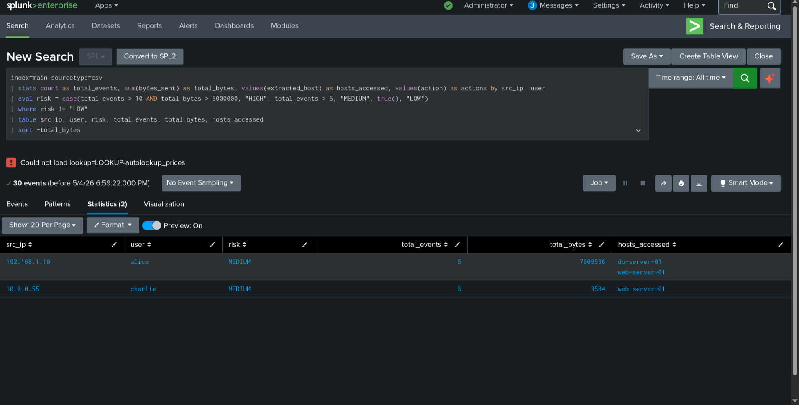

This is your executive summary query. It compresses the entire investigation — the brute force, the lateral movement, the data exfiltration — into a single scored table. 

Running this at the start of an investigation tells you within seconds who your high-risk entities are without reading thousands of individual events. It surfaces both alice (exfiltration, HIGH due to bytes) and bob/185.220.101.5 (lateral movement, HIGH due to events + bytes + multiple hosts) in one view.
`| stats count as total_events, sum(bytes_sent) as total_bytes, values(host) as hosts_accessed, values(action) as actions by src_ip, user`
This single stats command computes four metrics at once for every unique src_ip + user combination:

`count as total_events` — total number of events, renamed to total_events using as
`sum(bytes_sent) as total_bytes` — adds up all bytes transferred by that IP/user pair
`values(host) as hosts_accessed` — values() collects all unique values of a field into a list. So instead of counting hosts, you get a list like [web-server-01, db-server-01, dc-server-01] — immediately showing you how many systems they touched
`values(action) as actions` — same idea, shows all action types that user/IP performed

`| eval risk = case(total_events > 10 AND total_bytes > 5000000, "HIGH", total_events > 5, "MEDIUM", true(), "LOW")`
This builds a simple risk scoring model using the metrics you just computed. The logic is:

* HIGH — more than 10 events AND more than 5MB transferred. The AND means both conditions must be true — high volume activity combined with large data transfer is the most suspicious combination
* MEDIUM — more than 5 events regardless of bytes. Could be normal, worth reviewing
* LOW — everything else, filtered out next

`| where risk != "LOW"` — drops all LOW risk entities from the results. This is how you reduce noise in threat hunting — you only want to see things worth investigating, not every normal user who logged in once.
`| table src_ip, user, risk, total_events, total_bytes, hosts_accessed` — final clean output showing only the fields an analyst needs to triage.
`| sort -total_bytes` — sorts by data transferred descending, putting the biggest data movers at the top. In exfiltration investigations, the highest bytes transferred is usually the most urgent finding.
